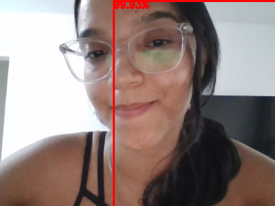
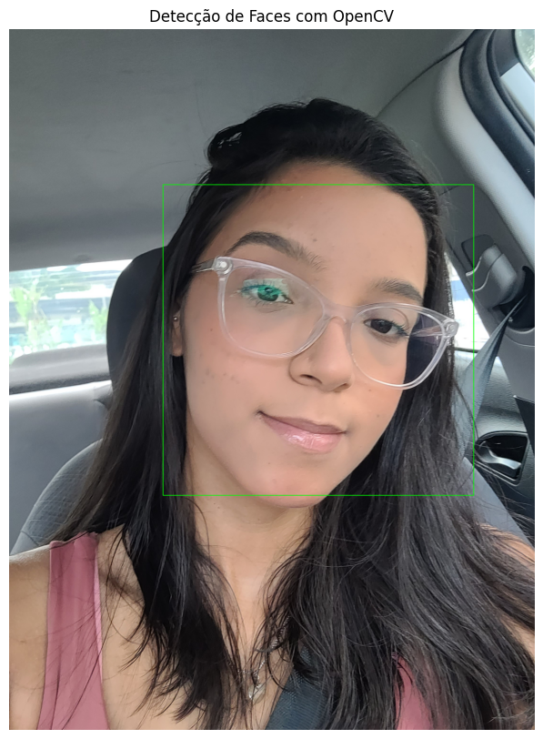

# Projeto: Sistema de Reconhecimento Facial

Este projeto visa realizar a detecção de faces e olhos em imagens e vídeos, utilizando dois modelos de redes neurais pré-treinados: o detector de face em Deep Learning do OpenCV, baseado na arquitetura Single Shot Detector (SSD) com a rede ResNet, e o modelo CascadeClassifier do OpenCV para classificação de faces e olhos.

## Detecção de face pela webcam com modelo pré-treinado
Este projeto utiliza o OpenCV para detectar faces em uma imagem capturada pela webcam, dividindo o processo em etapas:

1. **Captura da Foto**: O usuário tira a foto diretamente na interface do Colab, utilizando um botão de captura. A imagem é salva em JPEG com qualidade de 80%.
2. **Download dos Arquivos do Modelo**: Os arquivos necessários para a detecção, `deploy.prototxt` e `res10_300x300_ssd_iter_140000.caffemodel`, são baixados da internet.
3. **Carregamento do Modelo**: O modelo é carregado no OpenCV usando `cv2.dnn.readNetFromCaffe` para configurar a rede neural.
4. **Processamento da Imagem**: A imagem é redimensionada para uma largura de 400 pixels e convertida em um formato compatível com a rede neural.

O modelo não gerou os resultados esperados, possivelmente devido à qualidade da imagem de entrada, configurações do modelo ou outros fatores técnicos que influenciam a detecção.

### Resultado

## Detecção de Faces com OpenCV
Foi utilizado o classificador Haarcascade do OpenCV, a célula detecta faces em uma imagem carregada, 
desenhando caixas verdes ao redor delas. Esse modelo teve um desempenho superior ao anterior.

### Resultado

## Classificação de Face e Olhos com OpenCV
Utilizando o classificador Haarcascade do OpenCV, o código detecta faces e olhos em uma imagem. 
Após carregar e converter a imagem para escala de cinza, dois classificadores são aplicados: um para faces e outro para olhos. 
As caixas delimitadoras são desenhadas ao redor das faces e dos olhos. A imagem resultante é exibida com as regiões destacadas.

Os resultados em geral foram satisfatórios, mas apresentaram alguns erros em alguns frames, possivelmente devido a limitações dos classificadores ou condições específicas da imagem, como iluminação e ângulo.

### Resultado

## Tecnologias Utilizadas

- **Python**: Linguagem de programação utilizada para o desenvolvimento do código.
- **OpenCV**: Biblioteca de visão computacional usada para o processamento de imagens e vídeos, incluindo a detecção de faces e olhos.
- **Google Colab**: Ambiente de desenvolvimento baseado na nuvem utilizado para executar o código e interagir com a webcam.
- **JavaScript**: Utilizado para capturar imagens pela webcam na interface do Colab.
- **Haarcascade Classifiers**: Modelos pré-treinados do OpenCV para a detecção de faces e olhos.
